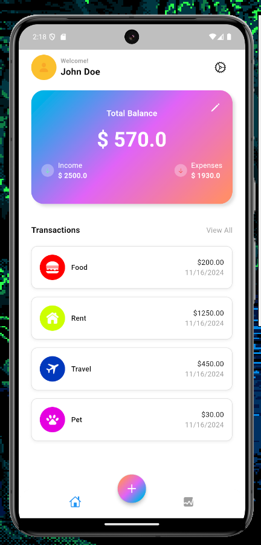
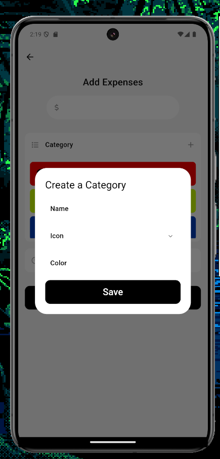

# Expense Tracker Application

A cross-platform mobile application built using **Flutter** and **Firebase** to help users manage their personal finances efficiently and intuitively.

---

## Features

### Dynamic Income and Expense Tracking
- Log expenses with details like category, amount, and date.
- Update income dynamically and view real-time balance calculations.

### Intuitive User Interface
- Clean and modern dashboard displaying total balance, income, and recent transactions.
- Bottom navigation bar for seamless switching between Home and Stats screens.

### Category Management
- Categorize expenses with custom icons and colors.
- View categorized expenses for better financial insights.

### Real-Time Data Management
- Synchronize expense and category data in real-time with **Firebase Firestore**.

### Responsive Design
- Compatible with **iOS** and **Android**, ensuring a consistent experience across devices.

---
## Screenshots

### Home Screen
The main dashboard shows the total balance, income, and recent expenses in a visually appealing format.


### Adding Expenses
Categorize expenses and log them with ease using an intuitive interface.


---

## Technologies Used

### Frontend
- **Flutter**: Cross-platform framework for building responsive and engaging UIs.
- **Material** and **Cupertino Widgets**: Platform-specific UI components for an enhanced design.
- **Intl Library**: Formats dates for consistent and localized transaction records.

### Backend
- **Firebase Firestore**: Real-time database for secure and scalable data storage.
- **Bloc Architecture**: Efficient state management for separating business logic from UI.

---

## How to Run

### Prerequisites
1. Install Flutter: [Flutter Installation Guide](https://flutter.dev/docs/get-started/install).
2. Set up Firebase for your project:
   - Add `google-services.json` (Android) and `GoogleService-Info.plist` (iOS) to the project.

### Steps to Run
1. Clone the Repository:
   ```bash
   git clone https://github.com/<your-username>/Expense-Tracker-Application.git
   ```
2. Install the Dependencies:
   ```bash
   flutter pub get
   ```
3. Run the Application:
   ```bash
   flutter run
   ```

# Key Functionalities

### Dashboard Overview
- Snapshot of total balance, income, and recent expenses.
- Features a gradient balance card for an enhanced user experience.

### Expense Logging
- Add expenses via a floating action button.
- Categorize expenses for clarity and better financial management.

### Dynamic Updates
- Automatically updates the UI when data changes.
- Recalculates the balance in real-time after logging expenses or updating income.

---

## Future Improvements

- **Analytics**: Add tools to visualize spending patterns over time.
- **User Authentication**: Enable personalized accounts for individual users.
- **Export Options**: Provide functionality to export transaction history.

---

## Contributors

- **Kyle Kucharski**  
  [GitHub](https://github.com/kylekucharski) | [LinkedIn](https://www.linkedin.com/in/kyle-kucharski-32603927a/)

---

## License

This project is licensed under the **MIT License**. See the [LICENSE](./LICENSE) file for details.

   
